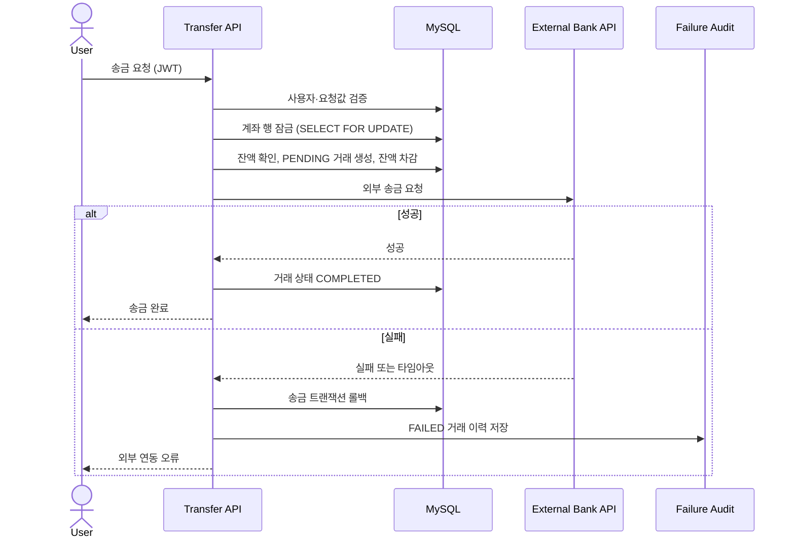

<div align="center">

# 안심뱅크 (AnsimBank)

### 가족이 함께 만드는 안전한 금융 경험

음성 송금, 가족 연결, 송금 위임을 통해 디지털 금융이 낯선 사용자도
안심하고 금융 서비스를 이용할 수 있도록 설계한 **KB 해커톤 장려상 수상작**입니다.

[](https://openjdk.org/)
[](https://spring.io/projects/spring-boot)
[](https://www.mysql.com/)
[](https://stomp.github.io/)

[Client Repository](https://github.com/KBeSafe/ansimbank_client) · [Team Server Repository](https://github.com/KBeSafe/ansimbank_server)

</div>

> 이 저장소는 팀 프로젝트 서버를 기반으로, 제가 담당한 영역과 해커톤 이후의 개인 개선 작업을 정리한 포트폴리오용 포크입니다. 팀 원본과 변경 이력은 분리되어 있습니다.

## 프로젝트 소개

안심뱅크는 계좌 연동과 송금 기능에 가족 단위의 연결·위임 흐름을 결합한 금융 서비스입니다. Clova STT/TTS를 활용한 음성 인터페이스, CODEF 기반 계좌 조회, Firebase 알림과 STOMP 실시간 통신을 하나의 Spring Boot 서버에서 제공합니다.

| 구분 | 내용 |
| --- | --- |
| 대회 | KB 해커톤 |
| 성과 | 장려상 수상 |
| 형태 | 팀 프로젝트 |

### 핵심 기능

- 계좌 연동 및 주계좌·원클릭 송금 프리셋 관리
- 일반 송금과 가족 위임 송금, 거래 내역 조회
- 부모·자녀 가족 연결 및 초대·승인 흐름
- Clova STT/TTS와 한국어 자연어 처리를 활용한 음성 송금
- Firebase Cloud Messaging 및 STOMP 기반 실시간 알림
- CODEF API 연동을 통한 계좌 정보 조회

## 담당 역할

**Backend Developer**

- 계좌·거래·송금·프리셋 도메인 엔티티와 Repository 설계
- 계좌 관리 및 송금 비즈니스 로직, REST API 구현
- CODEF OAuth2 인증과 RSA 암호화를 포함한 계좌 연동 구현
- 가족 연결 도메인과 부모·자녀 승인 흐름 구현
- JWT 인증을 프론트엔드 요청 흐름에 통합

담당 범위는 팀 저장소의 커밋 이력을 기준으로 작성했습니다.

## 개인 개선 작업

해커톤 종료 후 포트폴리오 브랜치에서 송금의 신뢰성과 운영 안전성을 보완했습니다.

- **동시 송금 직렬화**: 송금 계좌 조회에 비관적 쓰기 락을 적용해 잔액 확인과 차감 사이의 경쟁 상태를 방지
- **Lost Update 방어**: 계좌 엔티티에 낙관적 락 버전을 추가해 다른 수정 경로가 최신 잔액을 덮어쓰지 않도록 보호
- **실패 보상과 감사 추적**: 외부 송금 실패 시 잔액 차감은 롤백하고, 실패 거래는 별도 트랜잭션으로 기록
- **금액 무결성**: 원 단위 정수 검증과 정확한 정수 변환으로 소수점 절삭을 차단
- **민감정보 보호**: 계좌번호·예금주 로그를 제거하거나 마스킹하고, 인증정보를 환경변수 기반 설정으로 분리

## 송금 처리 흐름



> 현재 외부 송금은 해커톤 시연을 위한 모의 구현입니다. 운영 환경에서는 Outbox/Saga와 정산 배치를 통해 외부 성공과 내부 커밋 사이의 불일치를 추가로 다뤄야 합니다.

## 기술 스택

| 영역 | 기술 |
| --- | --- |
| Backend | Java 17, Spring Boot 3.5, Spring Data JPA, Spring Security |
| Database | MySQL |
| Authentication | JWT |
| Realtime | WebSocket, STOMP, Firebase Cloud Messaging |
| External API | CODEF, Naver Clova STT/TTS |
| Test & Build | JUnit 5, Gradle |

## 로컬 실행

```bash
git clone https://github.com/hj1016/ansimbank_server.git
cd ansimbank_server/ansimbank
cp src/main/resources/application.example.yml src/main/resources/application.yml
```

`application.yml`에서 사용하는 DB, JWT, CODEF, Clova, Firebase 값은 환경변수로 주입합니다. Firebase를 사용할 때만 `FIREBASE_ENABLED=true`와 로컬 인증 파일 경로를 설정하세요. 인증 파일과 실제 비밀값은 Git에 커밋하지 않습니다.

```bash
./gradlew bootRun
```

## 프로젝트 구조

```text
ansimbank/src/main/java/com/grandma/ansimbank
├── account       # 계좌 연동·관리
├── transfer      # 일반·원클릭·위임 송금
├── transaction   # 거래 내역
├── family        # 가족 연결
├── delegation    # 송금 위임
├── external      # CODEF 연동
├── stt / tts     # 음성 인터페이스
├── fcm           # 푸시 알림
└── common        # 인증, 예외, 공통 응답
```
